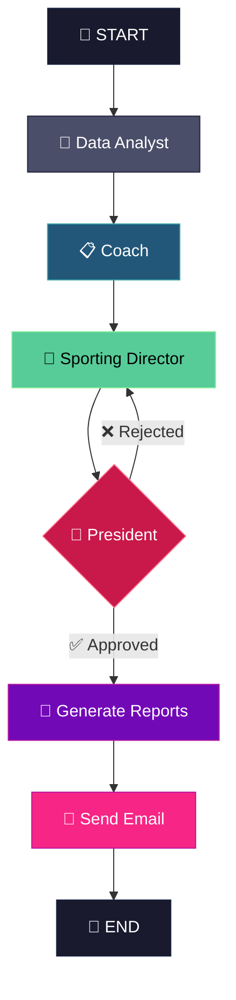

# ⚽ Fantasy Crew — Agentic AI for Biwenger


> 📖 Also available in [Català](docs/README.ca.md) · [Español](docs/README.es.md)

This project explores how **agentic AI** can make strategic decisions in a dynamic, competitive environment. Inspired by Billy Beane's **Moneyball** philosophy, the system aims to maximize points within a given budget by treating players as undervalued assets rather than just names.

The agents operate autonomously: extracting real-time data, analyzing performance trends, and generating actionable transfer recommendations—delivered directly to your inbox.

---

## 🎯 Core Concept

**The Moneyball Approach to Fantasy Football**

Traditional fantasy managers rely on intuition, star names, and emotional attachment. This system takes a different approach:

- **Efficiency over prestige** → Cost per Expected Point (€/xP) is the key metric
- **Momentum over reputation** → Recent form matters more than historical averages
- **Data over gut feeling** → Every decision is backed by statistical evidence

---

## 🤖 The Agent Team

The system orchestrates **four specialized AI agents**, each with a distinct role in the decision-making pipeline.

| Agent | Role | Key Responsibility |
|-------|------|-------------------|
| **📊 Data Analyst** | The Foundation | Extracts, cleans, and enriches data from multiple sources |
| **📋 Coach** | The Tactician | Analyzes squad, recommends lineups, identifies weak spots |
| **💼 Sporting Director** | The Broker | Scans market for value signings, proposes transfers |
| **🧠 President** | The Authority | Validates proposals, ensures financial sustainability |

### Agent Details

**🔮 Data Analyst**
- Fuzzy matching across Biwenger, Comuniate, and betting data
- Calculates `EXPECTED_POINTS (xP)` based on form and probability of playing
- Computes `COST_PER_XP` — the ultimate efficiency metric

**📋 Coach**
- Maximizes lineup xP while respecting position constraints
- Flags players with declining `MOMENTUM_TREND` for potential sale
- Prioritizes offensive formations (3-4-3) when possible

**💼 Sporting Director**
- Targets signings with lowest `COST_PER_XP`
- Detects market inefficiencies (improving players priced below value)
- Ensures positive balance before each gameweek

**🧠 President**
- Applies financial severity — rejects risky expenditures
- Protects high-investment assets from being sold at a loss
- Issues final executive decisions

---

## 🔄 Workflow Architecture

The system uses **LangGraph** to orchestrate the agent workflow with explicit state management and conditional routing.



**Key Features:**
- **Conditional Routing:** If the President rejects a proposal, it loops back to the Sporting Director for revision
- **State Persistence:** Each agent receives context from previous steps
- **Email Notifications:** Final report delivered via Gmail SMTP

---

## 📊 Data Sources

| Source | Type | Data Provided |
|--------|------|--------------|
| **Biwenger API** | Official | Players, prices, fitness, league standings, market |
| **Comuniate** | Web Scraping | Probable lineups, starting probability, injury alerts |
| **Jornada Perfecta** | RSS Feed | Real-time news (injuries, rotations, press conferences) |
| **EuroClubIndex** | Odds | Match probabilities (1X2) for difficulty assessment |

---

## 🛠️ Tech Stack

| Component | Technology |
|-----------|------------|
| **Orchestration** | LangGraph (StateGraph) |
| **LLM** | DeepSeek API |
| **Data Processing** | pandas, thefuzz |
| **Web Scraping** | BeautifulSoup, httpx |
| **Email** | SMTP (Gmail) |
| **Language** | Python 3.10+ |

---

## 🚀 Getting Started

### Prerequisites

- Python 3.10+
- A Biwenger account
- DeepSeek API key
- Gmail account with App Password enabled

### Installation

```bash
# Clone the repository
git clone https://github.com/yourusername/fantasy-crew.git
cd fantasy-crew

# Create virtual environment
python3 -m venv .venv
source .venv/bin/activate  # Linux/Mac
# .venv\Scripts\activate   # Windows

# Install dependencies
pip install -r requirements.txt
```

### Configuration

Create a `.env` file in the project root:

```env
# Biwenger Authentication
BIWENGER_EMAIL=your_biwenger_email@example.com
BIWENGER_PASSWORD=your_biwenger_password

# LLM API
DEEPSEEK_API_KEY=your_deepseek_api_key

# Gmail Notifications (Optional)
GMAIL_ADRESS=your_gmail@gmail.com
GMAIL_PASSWORD=your_app_password

# Score Type
SCORE_TYPE=5 #1: AS points / 2: SofaScore / 5: AVG AS and SofaScore / 3: Stats / 6: Biwenger Social
```

> **Note:** For Gmail, you need to generate an [App Password](https://support.google.com/accounts/answer/185833) — your regular password won't work.

### Running the System

```bash
# Full execution with LangGraph orchestration
python main_langgraph.py
```

### Output

Reports are saved to `./reports/`:
- `00_final_report.md` — Consolidated report
- `01_coach_report.md` — Squad analysis
- `02_sporting_director_proposals.md` — Transfer recommendations
- `03_president_decision.md` — Final decisions

If email is configured, the report is also sent to your inbox.

---

## 📁 Project Structure

```
fantasy-crew/
├── main.py                    # Classic sequential entry point
├── main_langgraph.py          # LangGraph orchestrated entry point
├── requirements.txt
├── .env                       # Configuration (not tracked)
├── src/
│   ├── agents/
│   │   ├── data_analyst.py    # Data extraction & feature engineering
│   │   ├── coach.py           # Lineup analysis
│   │   ├── sporting_director.py # Market proposals
│   │   └── president.py       # Final decisions
│   ├── graph/
│   │   ├── state.py           # LangGraph state schema
│   │   ├── nodes.py           # Agent node functions
│   │   └── graph.py           # StateGraph builder
│   └── utils/
│       └── email_sender.py    # Gmail SMTP utility
├── data/                      # Extracted CSVs (generated)
├── reports/                   # Agent output (generated)
└── docs/
    └── DATA_DICTIONARY.md     # Field documentation
```

---

## 📄 License

MIT License — Feel free to use, modify, and distribute.

---

## 👤 Author

**Daniel Sanchez**  
[LinkedIn](https://linkedin.com/in/daniel-sanchez-rodriguez-51084031) · [GitHub](https://github.com/dani537)

---

> *"The goal isn't to buy players. The goal is to buy wins."* — Billy Beane
