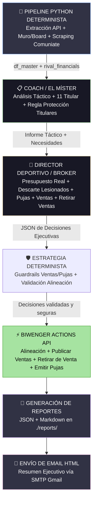

# ⚽ Biwenger Agent — Autonomous Agentic AI for Fantasy Football

> **Filosofía Moneyball:** Maximizar la rentabilidad por punto esperado ($€/xP$) eliminando sesgos emocionales y tomando decisiones tácticas y financieras basadas en datos empíricos.
>
> **Sistema de Puntuación:** Media Picas AS + SofaScore (`SCORE_TYPE = 5`).

---

## 📌 Visión General y Propósito

**Biwenger Agent** (Fantasy Crew) es una plataforma de **Inteligencia Artificial Agéntica (Agentic AI)** diseñada para gestionar de forma autónoma, integral y automatizada un equipo en **Biwenger** (LaLiga).

El proyecto combina:
1. **Extracción y procesamiento determinista en Python**: Descarga y consolida datos oficiales de la API de Biwenger, métricas del muro de transacciones de la liga (pujas anteriores y saldos de rivales), alineaciones de Comuniate y cuotas de partidos.
2. **Razonamiento Agéntico Especializado (LLM)**: Dos roles principales (el Míster y el Director Deportivo) que analizan la situación táctica y financiera en pasos especializados para evitar sobrecarga de contexto.
3. **Capa de Estrategia Determinista (`src/strategy/`)**: Los LLMs proponen, pero Python valida. Antes de tocar la API real, todas las decisiones pasan por guardrails duros (protección de titulares, protección de valor/cláusulas, tamaño mínimo de plantilla, límites de presupuesto) y la alineación se valida posición a posición con un fallback determinista.
4. **Ejecución Directa en API**: Guarda alineaciones, publica jugadores en el mercado, retira de la venta a titulares colocados por error y emite pujas inteligentes de forma automatizada en tu cuenta de Biwenger (dirigiendo las ofertas al rival vendedor cuando es necesario), notificándote el resumen por correo electrónico.

---

## 🔄 Arquitectura del Flujo de Trabajo

El flujo del sistema se organiza de forma lineal, rápida y robusta mediante **LangGraph (`StateGraph`)**:


```mermaid
graph TD
    A[🚀 PIPELINE PYTHON DETERMINISTA<br/>Extracción API + Muro/Board + Scraping Comuniate] -->|df_master + rival_financials| B[📋 COACH / EL MÍSTER<br/>Análisis Táctico + 11 Titular + Regla Protección Titulares]
    
    B -->|Informe Táctico + Necesidades| C[💼 DIRECTOR DEPORTIVO / BROKER<br/>Presupuesto Real + Descarte Lesionados + Pujas + Ventas + Retirar Ventas]
    
    C -->|JSON de Decisiones Ejecutivas| G[🛡️ ESTRATEGIA DETERMINISTA<br/>Guardrails Ventas/Pujas + Validación Alineación]
    
    G -->|Decisiones validadas y seguras| D[⚡ BIWENGER ACTIONS API<br/>Alineación + Publicar Ventas + Retirar de Venta + Emitir Pujas]
    
    D --> E[📄 GENERACIÓN DE REPORTES<br/>JSON + Markdown en ./reports/]
    E --> F[📧 ENVÍO DE EMAIL HTML<br/>Resumen Ejecutivo vía SMTP Gmail]

    style A fill:#313244,stroke:#89b4fa,color:#fff
    style B fill:#181825,stroke:#a6e3a1,color:#fff
    style C fill:#181825,stroke:#f9e2af,color:#fff
    style D fill:#a6e3a1,stroke:#40a02b,color:#000
    style E fill:#313244,stroke:#cba6f7,color:#fff
    style F fill:#313244,stroke:#f5c2e7,color:#fff
```

---

## 📊 INVENTARIO Y DICCIONARIO DETALLADO DE DATOS EXTRAÍDOS (`./data/`)

El pipeline determinista en Python descarga y procesa múltiples fuentes de datos estructurados guardándolos en `./data/`. Esta información sirve como entrada enriquecida para que los modelos de IA tomen decisiones óptimas:

### 1. 🆔 `user_info.csv` (Perfil y Balance Financiero del Usuario)
Contiene la información de cuenta autenticada y el saldo bancario exacto:
* `user_id`: ID numérico del usuario en Biwenger.
* `league_id`: ID numérico de la liga actual (`la-liga`).
* `user_name`: Nombre del manager (`Daniel Sanchez Rodriguez`).
* `league_name`: Nombre de la liga (`AZ Finance`).
* `team_name`: Nombre del equipo (`Dani SR`).
* `balance`: **Saldo disponible real en euros (€)** (ej. `19285000` = 19,285,000 €).
* `score`: Puntos totales acumulados en la temporada.
* `team_value`: Valor total estimado de la plantilla actual.

---

### 2. ⚽ `players.csv` (Catálogo Master de Jugadores de LaLiga)
Información base de todos los jugadores de la competición (~550 jugadores):
* `PLAYER_ID`: Identificador único numérico del jugador en Biwenger (ej. `41022`, `14630`, `163`).
* `PLAYER_NAME`: Nombre deportivo del jugador.
* `PLAYER_POSITION`: Posición principal (`POR`, `DEF`, `MED`, `DEL`).
* `TEAM_NAME`: Nombre del equipo real de LaLiga (ej. `Real Madrid`, `Mallorca`, `Athletic`).
* `PLAYER_PRICE`: Valor de mercado actual en euros (€).
* `PLAYER_PRICE_INCREMENT`: Variación diaria de precio a 24 horas (ej. `+100000` o `-50000`). Mide la racha/especulación económica.
* `PLAYER_STATUS`: Estado médico/físico actual (`ok`, `injured`, `doubt`, `suspended`).
* `AVG_POINTS`: Promedio histórico de puntos por partido bajo el sistema **Media Picas AS + SofaScore (`SCORE_TYPE = 5`)**.

---

### 3. 🛒 `market.csv` (Mercado de Subastas del Día)
Jugadores libres puestos en el mercado por la máquina o por rivales hoy:
* `PLAYER_ID`: ID numérico del jugador libre.
* `MARKET_SALE_PRICE`: Precio mínimo de salida/venta en euros (€).
* `MARKET_SALE_UNTIL`: Timestamp límite de cierre de la subasta.
* `MARKET_SALE_USER_NAME`: `None` si es de la banca (libre) o nombre del rival vendedor.

---

### 4. 👥 `my_players.csv` (Plantilla del Usuario)
Jugadores pertenecientes a nuestro equipo:
* `PLAYER_ID`: ID del jugador de nuestra plantilla.
* `BIWPLAYER_PURCHASE_PRICE`: Precio pagado al ficharlo.
* `BIWPLAYER_CLAUSE`: Cláusula de rescisión actual del jugador.

---

### 5. 🧱 Muro de la Liga / Board API (`board_transfers.csv`, `board_bids.csv`, `rival_financials.csv`)
Información extraída del muro `/api/v2/league/{id}/board?limit=100`:
* **`board_transfers.csv`**: Histórico de las últimas 100 compras, ventas y clausulazos de la liga (quién compró a quién, fecha y monto pagado).
* **`board_bids.csv`**: Registro de **pujas no ganadoras de los rivales** con importes exactos gastados u ofertados. Permite medir el grado de sobrepuja de cada rival.
* **`rival_financials.csv`**: Balance financiero estimado de todos los managers de la liga:
  * `RIVAL_NAME`: Nombre del manager rival.
  * `TOTAL_SPENT`: Gastos totales en fichajes recientes.
  * `TOTAL_INCOME`: Ingresos totales por ventas.
  * `NET_BALANCE_CHANGE`: Variación neta de liquidez (permite saber cuánto dinero disponible le queda a cada rival).

---

### 6. 📰 Datos Externos: Comuniate, Cuotas y Noticias
* **`comuniate.csv`**:
  * `COMUNIATE_STARTER`: % probabilidad de ser titular esta jornada (1.0 = 100%, 0.8 = 80%).
  * `COMUNIATE_SUB`: % probabilidad de entrar desde el banquillo.
  * `PLAYER_STATUS_INFO`: Detalle preciso de lesión, sanción o dudas.
* **`odds.csv` / `next_jornada.csv`**:
  * `ODDS_1` / `ODDS_X` / `ODDS_2`: Cuotas de apuestas reales (EuroClubIndex) para el partido del jugador. Determina la probabilidad de victoria y exigencia del rival.
* **`news.csv`**: Titulares y noticias de última hora de Jornada Perfecta.

---

### 7. 🏆 Consolidado y Feature Engineering: `_master.csv` (`df_master`)
Es el DataFrame maestro resultante que combina todas las fuentes en 45 métricas clave:
* **`EXPECTED_POINTS (xP)`**: Puntos esperados para la jornada activa. Calculado mediante una fórmula avanzada que combina rendimiento medio por split local/visitante, racha reciente (*Momentum*), probabilidad de minutos (titular/suplente en Comuniate), ajuste por cuotas de apuestas de victoria (`ODDS_1`/`ODDS_2`) y penalización por estado físico (`doubt` / lesionado):
  $$\text{xP} = \text{Base\_Rating} \times (\text{COMUNIATE\_STARTER} + 0.75 \times \text{COMUNIATE\_SUB}) \times \text{Match\_Factor(Odds)} \times \text{Penalty(Doubt)}$$
* **`COST_PER_XP`**: Métricas Moneyball de eficiencia ($€ / \text{xP}$). Mide cuántos millones de euros pagamos por cada punto esperado. **Cuanto más bajo, más rentable**.
* **`COST_PER_MOMENTUM_POINT`**: Coste en millones por punto de racha reciente.
* **`MOMENTUM_TREND`**: Tendencia de rendimiento e incremento de valor en el mercado.

---

## 🧠 Estructura de Agentes y Toma de Decisiones

### 📋 Agente 1: El Coach / El Míster (`src/agents/coach.py`)
* **Misión**: Análisis strictly deportivo para maximizar puntos en la jornada.
* **Sistema de Puntuación**: Media Picas AS + SofaScore (`SCORE_TYPE = 5`).
* **Regla de Protección de Titulares (`STARTER PROTECTION RULE`)**: Prohibido recomendar la venta de cualquier jugador con titularidad $\ge$ 70% en Comuniate (`COMUNIATE_STARTER`) o alineado en el 11 titular salvo lesión grave.
* **Resultados**:
  1. Selecciona la formación ideal (3-4-3, 4-3-3, 3-5-2, etc.).
  2. Determina el 11 titular de mayor rendimiento esperado con sus `PLAYER_ID`s reales.
  3. Clasifica la plantilla propia en: `INTOCABLES`, `PRESCINDIBLES` y `VENTA_URGENTE`.
  4. Informa de necesidades posicionales al Director Deportivo.

---

### 💼 Agente 2: Director Deportivo / Decisor Final (`src/agents/sporting_director.py`)
* **Modelo LLM**: **`DeepSeek-V4-Flash`** (`deepseek-v4-flash`), rápido, preciso en formato JSON y optimizado para contextos extensos.
* **Misión**: Control financiero, pujas estratégicas en el mercado, ventas y retiro de ofertas erróneas.
* **Señales que evalúa para cada jugador del mercado**:
  * `COMUNIATE_STARTER` — probabilidad de titularidad (la señal más fuerte a corto plazo).
  * `EXPECTED_POINTS` / `COST_PER_XP` — puntos esperados avanzados y eficiencia €/xP (Moneyball).
  * `MOMENTUM_TREND` — forma reciente vs media de temporada.
  * `TEAM_IS_HOME` + `ODDS_1/ODDS_2` — dificultad del próximo partido (cuotas reales de apuestas).
  * `PLAYER_PRICE_INCREMENT` — hype del mercado (comprar activos en alza para trading/plusvalía).
  * `PLAYER_STATUS` — lesionados descartados automáticamente.
  * `board_bids.csv` — histórico de sobrepujas de rivales para calibrar el importe empírico por posición.
* **Jerarquía de decisión en pujas**: (1) cubrir huecos estructurales antes que fichar estrellas en líneas cubiertas, (2) titularidad > forma > cuotas favorables, (3) tendencia de precio positiva justifica competir la subasta, (4) libre disposición del 100% del presupuesto para fichar cracks o estrellas justificadas.
* **Reglas financieras duras**: suma de pujas ≤ presupuesto disponible real (saldo − pujas ya comprometidas) · puja individual hasta el 100% del saldo libre · cobertura de subastas (2 objetivos para gaps críticos como el portero) · anti-duplicados (no pujar dos veces por el mismo jugador) · auto-cancelación de pujas sobre lesionados.

---

## 🛡️ Capa de Estrategia Determinista (`src/strategy/`)

Los LLMs son brillantes razonando, pero cometen errores de conteo, alucinan IDs y violan sus propias reglas. Por eso **ninguna decisión llega a la API sin pasar por validación determinista**:

### Alineación (`lineup.py`)
* **Validación estricta**: exactamente 11 jugadores, formación conocida, exactamente 1 portero, conteo DF/MF/FW coherente con la formación y todos los IDs de nuestra plantilla.
* **Fallback automático**: si la alineación del Míster es ilegal, se calcula el mejor XI posible maximizando xP (o probabilidad de titularidad + precio en pretemporada) con restricciones de posición.
* **Ordenación para la API**: los IDs se envían ordenados GK → DF → MF → FW, como exige Biwenger.
* Si no hay XI legal posible (p. ej. sin portero), no se toca la alineación y se prioriza fichar GK.

### Guardrails de mercado (`guardrails.py`)
* **Ventas bloqueadas si**: la plantilla quedaría con menos de 11 jugadores sanos · es nuestro único portero · es titular probable (≥70%) y sano · el precio realiza una pérdida >30% vs lo pagado (protección de cláusulas).
* **Pujas bloqueadas si**: el jugador está lesionado · la puja es inferior al precio mínimo de subasta · la suma total de pujas excede el **presupuesto disponible real** (saldo − pujas ya comprometidas) · ya tenemos una puja pendiente por ese jugador (anti-duplicados).
* **Limpieza de pujas pendientes**: se auto-cancela cualquier puja nuestra sobre un jugador lesionado/sancionado, y el Director Deportivo puede cancelar pujas que ya no tengan sentido (`operaciones_cancelar_pujas`).
* **Priorización por necesidades**: las pujas que cubren posiciones sin cubrir (auditoría determinista de plantilla) van primero; el resto solo si queda presupuesto.
* **Ofertas a rivales**: si el vendedor es otro manager (fase `post_auction`), la oferta se dirige automáticamente a su `user_id` negociando a la baja.

---

## ⚡ Módulo de Ejecución en Biwenger API (`src/actions/`)
El módulo `BiwengerActions` se conecta a la API autenticada de Biwenger:
* `LineupActions.set_lineup`: Guarda automáticamente la alineación titular y la formación en la plataforma.
* `MarketActions.place_player_on_market`: Coloca a la venta los jugadores indicados con precio $\ge$ mercado.
* `MarketActions.remove_player_from_market`: Elimina a un jugador del mercado (cancela su venta) mediante `DELETE /api/v2/market?player={id}`.
* `MarketActions.place_offer`: Realiza las pujas automatizadas en las subastas del mercado.

---

## 📧 Reportes y Notificaciones (`src/utils/` + `src/briefing.py`)

El agente envía un email con formato de **periódico deportivo** ("Biwenger Chronicle", HTML compatible con Gmail: tablas + CSS inline). El idioma del email se controla con `LANGUAGE` en `.env` (`es`, `en`, `ca`...). Los prompts internos de razonamiento están en inglés; solo el periódico se escribe en tu idioma. Además, cada ejecución guarda el HTML en `./reports/email_preview.html` para previsualizar el diseño sin enviar nada.

### Ejecuciones diarias (diseñado para el reset de mercado de las 7:00)

| Modo | Cuándo | Qué hace |
|---|---|---|
| `--mode action` (por defecto) | Cualquier hora del día | Pipeline completo: Míster + Director Deportivo + ejecución de acciones (alineación, pujas, ventas, cancelaciones) + email con la crónica |
| `--mode auction` | **~6:55**, momento de las subastas | **Detecta automáticamente la hora de resolución** (lee los `until` del mercado). Si hay margen (>4 min), ejecuta el análisis y las pujas; si llegas justo, espera esos minutos al cierre. Tras la resolución: re-extrae datos, informa de subastas ganadas/perdidas y **cancela las pujas redundantes** (ej. ganas un portero → cancela tus otras pujas de portero) |
| `--mode briefing` | **~7:10**, tras el reset | Solo lectura: email matutino explicando qué pasó esta noche + la misma limpieza determinista de pujas redundantes. **1 sola llamada LLM** (ahorro de tokens) |

Ejemplo de `cron` local:
```cron
55 6 * * *  cd /ruta/al/proyecto && .venv/bin/python main.py --mode auction
10 7 * * *  cd /ruta/al/proyecto && .venv/bin/python main.py --mode briefing
```

### GitHub Actions (`.github/workflows/biwenger_agent.yml`)

El workflow ya viene configurado con los dos disparos diarios (**el cron de GitHub es UTC**: `45 4 * * *` = 6:45 CEST para `auction`, `10 5 * * *` = 7:10 CEST para `briefing`). Configura los *secrets* (`BIWENGER_USERNAME`, `BIWENGER_PASSWORD`, `DEEPSEEK_API_KEY`, `GMAIL_PASSWORD`) y las *variables* (`GMAIL_ADRESS`, `LANGUAGE`, `SCORE_TYPE`) en el repositorio. También permite ejecución manual eligiendo modo y `dry_run`.

> [!WARNING]
> Los workflows programados de GitHub pueden retrasarse varios minutos en horas punta. El modo `auction` lo tiene en cuenta: si arranca tarde y no hay margen para analizar y pujar antes del cierre, no improvisa — espera a la resolución y gestiona el resultado.

---

## 🛠️ Estructura del Código

```text
/home/daniel/Code/006. Biwenger Agent/
├── main.py                     # Punto de entrada principal para ejecutar el agente
├── README.md                   # Documentación principal unificada
├── requirements.txt            # Dependencias del proyecto
├── .env                       # Configuración de credenciales y score ID
├── src/
│   ├── actions/                # Operaciones de escritura en Biwenger API
│   │   ├── market_actions.py   # Pujas, ofertas, ventas y retirar de venta
│   │   └── lineup_actions.py   # Guardado de alineación y esquemas tácticos
│   ├── agents/                 # Lógica de razonamiento agéntico (LLM DeepSeek)
│   │   ├── coach.py            # El Míster (Análisis táctico)
│   │   └── sporting_director.py # Director Deportivo (Decisiones de mercado y finanzas)
│   ├── strategy/               # Capa de estrategia determinista (validación anti-LLM)
│   │   ├── lineup.py           # Selección óptima del XI + validación de alineaciones
│   │   └── guardrails.py       # Reglas duras de seguridad para ventas y pujas
│   ├── data_extraction/        # Pipeline determinista en Python
│   │   ├── auth.py             # Autenticación y gestión de sesión Biwenger
│   │   ├── biwenger_data.py    # Extracción de API Biwenger y Muro/Board de la liga
│   │   ├── external_data.py    # Scraping Comuniate, Noticias RSS y Cuotas
│   │   ├── transformers.py    # Matching difuso y Feature Engineering (df_master)
│   │   └── runner.py           # Orquestador del pipeline de datos
│   ├── graph/                  # Definición del flujo simplificado en LangGraph
│   │   ├── state.py            # Esquema del TypedDict AgentState
│   │   ├── nodes.py            # Definición de nodos de ejecución
│   │   └── graph.py            # Grafo compilado StateGraph
│   ├── llm_endpoints/          # Cliente API DeepSeek (deepseek-v4-flash)
│   ├── prompts/                # Prompts modulares para Coach, SD y Email
│   └── utils/                  # Plantillas HTML Jinja2 y cliente SMTP
├── data/                       # CSVs y Excel generados durante la extracción
├── test/                       # Suites de prueba ordenadas por componente
│   ├── 01_data_extraction/run.py # Test de la extracción determinista (online/offline)
│   ├── 02_coach/run.py          # Test del Entrenador (Mister) y generación de prompt/veredicto
│   ├── 03_director/run.py       # Test del Director Deportivo (Broker) y plano financiero
│   └── 99_pujas/run.py          # Estudio analítico de sobrepujas y modelo econométrico OLS
└── reports/                    # Informes finales generados en cada ejecución
```

---

## 🚀 Guía de Uso

### 1. Configuración del entorno `.env`
Crea o verifica el archivo `.env` en la raíz del proyecto:
```env
BIWENGER_USERNAME=tu_email@ejemplo.com
BIWENGER_PASSWORD=tu_contraseña

# Configuración LLM Multi-Proveedor (OpenRouter, DeepSeek direct, OpenAI, custom)
LLM_PROVIDER=openrouter                 # openrouter, deepseek, openai, custom
OPENROUTER_API_KEY=tu_openrouter_key    # API Key para OpenRouter
LLM_MODEL=deepseek/deepseek-chat        # Modelo LLM (ej: deepseek/deepseek-chat, anthropic/claude-3.5-sonnet)

# Alternativa legacy / DeepSeek directo:
# DEEPSEEK_API_KEY=tu_deepseek_key
# DEEPSEEK_MODEL=deepseek-chat

GMAIL_ADRESS=tu_email_gmail@gmail.com
GMAIL_PASSWORD=tu_app_password_gmail
SCORE_TYPE=5  # 5: Media Picas AS y SofaScore (por defecto 5 si se omite)
LANGUAGE=es   # Idioma del email periódico: es, en, ca, fr, de, it, pt
DRY_RUN=false # true: simula toda la ejecución sin escribir nada en Biwenger
```

### 2. Pruebas y Validación por Componentes
Puedes ejecutar la prueba de cada módulo haciendo correr su correspondiente `run.py`:

```bash
# Test 1: Extracción de Datos
.venv/bin/python test/01_data_extraction/run.py [--offline | --online]

# Test 2: Entrenador (Mister)
.venv/bin/python test/02_coach/run.py

# Test 3: Director Deportivo (Broker)
.venv/bin/python test/03_director/run.py

# Test 99: Estudio Analítico y Predictivo de Pujas
.venv/bin/python test/99_pujas/run.py
```

### 3. Ejecutar el Flujo Completo del Agente
```bash
.venv/bin/python main.py                    # Modo acción autónomo
.venv/bin/python main.py --phase pre_auction# Modo acción simulando fase Pre-7:00 AM
.venv/bin/python main.py --phase post_auction# Modo acción simulando fase Post-7:00 AM
.venv/bin/python main.py --mode briefing    # Modo briefing matutino (tras el reset)
DRY_RUN=true .venv/bin/python main.py       # Simulación segura (sin escrituras en API)
```

---
*Biwenger Agent Manager — Sistema Agéntico de Inteligencia Competitiva.*
