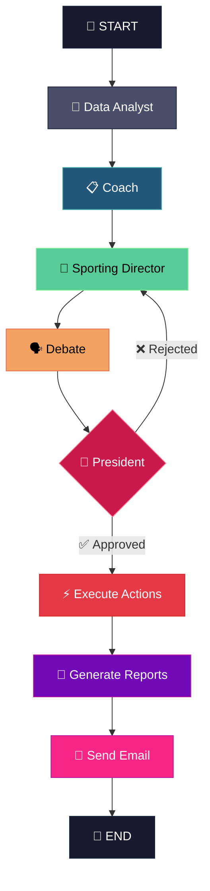

# ⚽ Fantasy Crew — Agentic AI for Biwenger


> 📖 Also available in [Català](docs/README.ca.md) · [Español](docs/README.es.md)

This project explores how **agentic AI** can make strategic decisions in a dynamic, competitive environment. Inspired by Billy Beane's **Moneyball** philosophy, the system aims to maximize points within a given budget by treating players as undervalued assets rather than just names.

The agents operate autonomously: extracting real-time data, analyzing performance trends, and generating actionable transfer recommendations—delivered directly to your inbox.

---

## 🎯 Core Concept

**The Moneyball Approach to Fantasy Football**

Traditional fantasy managers rely on intuition, star names, and emotional attachment. This system takes a different approach:

- **Efficiency over prestige** → Cost per Expected Point (€/xP) is the key metric
- **Momentum over reputation** → Recent form matters more than historical averages
- **Data over gut feeling** → Every decision is backed by statistical evidence

---

## 🤖 The Agent Team

The system orchestrates **four specialized AI agents**, each with a distinct role in the decision-making pipeline.

| Agent | Role | Key Responsibility |
|-------|------|-------------------|
| **📊 Data Analyst** | The Foundation | Extracts, cleans, and enriches data from multiple sources |
| **📋 Coach** | The Tactician | Analyzes squad, recommends lineups, identifies weak spots |
| **💼 Sporting Director** | The Broker | Scans market for value signings, proposes transfers |
| **🧠 President** | The Authority | Validates proposals, ensures financial sustainability |

### Agent Details

**🔮 Data Analyst**
- Extracts market data, player stats, and financial context (budgets, rivals' value).
- Pulls **pending received offers** from the system for evaluation.
- Normalizes data from diverse sources (Biwenger, Comuniate, Jornada Perfecta).
- Autocalculates key situational metrics (e.g., `AVG_POINTS_HOME`, `COST_PER_XP`).

**📋 Coach**
- Analyzes individual player performance based on the Data Analyst's extractions.
- Generates a **strict JSON "Briefing"** outputting tactical needs and sales priorities.
- Labels constraints using predefined Enums (`disponible`, `lesionado`, `intocable`, `venta_urgente`), avoiding unstructured text.
- Allocates recommended budget percentages for each required position.

**💼 Sporting Director**
- Translates the Coach's "Briefing" into exact monetary bids and sale prices.
- Directly resolves **pending market offers** (accept/reject/maintain).
- Handles **"Empty Market"** scenarios (gracefully reporting when no suitable players are available).
- Implements the **Golden Rule** (`saldo_proyectado_post_operaciones`): automatically voids bids if they project a negative balance within 48h of a gameweek start.

**🧠 President**
- Validates the Sporting Director's operations against long-term strategy.
- Can invoke a **Debate** round, asking the Coach for a second opinion on the Sporting Director's proposed targets before approving.
- Protects high-investment assets and makes the final executive "Go/No-Go" decision.

---

## 🔄 Workflow Architecture

The system uses **LangGraph** to orchestrate the agent workflow with explicit state management, a **debate round** between Coach and Sporting Director, and conditional routing.


```mermaid
graph TD
    A[🚀 START] --> B[🔮 Data Analyst]
    B --> C[📋 Coach]
    C --> D[💼 Sporting Director]
    D --> DB[🗣️ Debate]
    DB --> E{🧠 President}
    
    E -->|✅ Approved| X[⚡ Execute Actions]
    E -->|❌ Rejected| D
    
    X --> F[📄 Generate Reports]
    F --> G[📧 Send Email]
    G --> H[🏁 END]
    
    style A fill:#1a1a2e,stroke:#16213e,color:#fff
    style B fill:#4a4e69,stroke:#22223b,color:#fff
    style C fill:#22577a,stroke:#38a3a5,color:#fff
    style D fill:#57cc99,stroke:#80ed99,color:#000
    style DB fill:#f4a261,stroke:#e76f51,color:#000
    style E fill:#c9184a,stroke:#ff758f,color:#fff
    style X fill:#e63946,stroke:#d62828,color:#fff
    style F fill:#7209b7,stroke:#b5179e,color:#fff
    style G fill:#f72585,stroke:#b5179e,color:#fff
    style H fill:#1a1a2e,stroke:#16213e,color:#fff
```

**Key Features:**
- **Agent Debate:** After the Sporting Director proposes transfers, the Coach critiques them from a tactical perspective before the President decides
- **Conditional Routing:** If the President rejects a proposal, it loops back to the Sporting Director for revision (max 2 iterations)
- **Automated Execution:** Approved operations (lineup, sales, bids) are automatically executed via the Biwenger API
- **State Persistence:** Each agent receives context from previous steps
- **Email Notifications:** Final report delivered via Gmail SMTP

---

## ⚡ Active API Actions

The `src/actions` module contains wrappers for writing back to the Biwenger API, turning the extracted data pipeline into an autonomous agent capable of executing decisions. Supported actions include:

### Market Operations (`MarketActions`)
- **Place Bids (`place_offer`)**: Bid for a player in the market or execute a direct release clause ('clausulazo'). You can bid to the computer (market) or other managers.
- **Sell Players (`place_player_on_market`)**: List your own players on the transfer market setting a custom starting price. 
- **Accept Offers (`accept_offer`)**: Accept incoming offers received for players currently on the market.

### Tactical Operations (`LineupActions`)
- **Set Lineups (`set_lineup`)**: Save the optimum generated starting eleven to Biwenger before the gameweek deadline (supports custom formations like "3-4-3" and player ID injection).

---

## 📊 Data Sources

| Source | Type | Data Provided |
|--------|------|--------------|
| **Biwenger API** | Official | Players, prices, fitness, league standings, market |
| **Comuniate** | Web Scraping | Probable lineups, starting probability, injury alerts |
| **Jornada Perfecta** | RSS Feed | Real-time news (injuries, rotations, press conferences) |
| **EuroClubIndex** | Odds | Match probabilities (1X2) for difficulty assessment |

---

## 🛠️ Tech Stack

| Component | Technology |
|-----------|------------|
| **Orchestration** | LangGraph (StateGraph) |
| **LLM** | DeepSeek API |
| **Data Processing** | pandas, thefuzz |
| **Web Scraping** | BeautifulSoup, httpx |
| **Email** | SMTP (Gmail) |
| **Language** | Python 3.10+ |

---

## 🚀 Getting Started

### Prerequisites

- Python 3.10+
- A Biwenger account
- DeepSeek API key
- Gmail account with App Password enabled

### Installation

```bash
# Clone the repository
git clone https://github.com/yourusername/fantasy-crew.git
cd fantasy-crew

# Create virtual environment
python3 -m venv .venv
source .venv/bin/activate  # Linux/Mac
# .venv\Scripts\activate   # Windows

# Install dependencies
pip install -r requirements.txt
```

### Configuration

Create a `.env` file in the project root:

```env
# Biwenger Authentication
BIWENGER_EMAIL=your_biwenger_email@example.com
BIWENGER_PASSWORD=your_biwenger_password

# LLM API
DEEPSEEK_API_KEY=your_deepseek_api_key

# Gmail Notifications (Optional)
GMAIL_ADRESS=your_gmail@gmail.com
GMAIL_PASSWORD=your_app_password

# Score Type
SCORE_TYPE=5 #1: AS points / 2: SofaScore / 5: AVG AS and SofaScore / 3: Stats / 6: Biwenger Social
```

> **Note:** For Gmail, you need to generate an [App Password](https://support.google.com/accounts/answer/185833) — your regular password won't work.

### Running the System

```bash
# Full execution with LangGraph orchestration
python main_langgraph.py
```

### Output

Reports are saved to `./reports/`:
- `00_final_report.md` — Consolidated report
- `01_coach_report.md` — Squad analysis
- `02_sporting_director_proposals.md` — Transfer recommendations
- `03_president_decision.md` — Final decisions

If email is configured, the report is also sent to your inbox.

---

## 📁 Project Structure

```
fantasy-crew/
├── main.py                    # Classic sequential entry point
├── main_langgraph.py          # LangGraph orchestrated entry point
├── requirements.txt
├── .env                       # Configuration (not tracked)
├── src/
│   ├── actions/
│   │   ├── __init__.py        # BiwengerActions facade
│   │   ├── market_actions.py  # Bids, sales, offers
│   │   └── lineup_actions.py  # Lineup/formation updates
│   ├── agents/
│   │   ├── data_analyst.py    # Data extraction & feature engineering
│   │   ├── coach.py           # Lineup analysis (logic only)
│   │   ├── sporting_director.py # Market proposals (logic only)
│   │   └── president.py       # Final decisions (logic only)
│   ├── prompts/               # ✏️ EDIT HERE to tune agent behavior
│   │   ├── system_roles.py    # System role strings for all agents
│   │   ├── coach_prompts.py   # Coach analysis + debate critique prompts
│   │   ├── sporting_director_prompts.py  # SD proposal prompt
│   │   └── president_prompts.py          # President decision prompt
│   ├── graph/
│   │   ├── state.py           # LangGraph state schema
│   │   ├── nodes.py           # Agent node functions (incl. debate)
│   │   └── graph.py           # StateGraph builder
│   ├── data_extraction/       # API auth, scraping, data pipeline
│   └── utils/
│       └── email_sender.py    # Gmail SMTP utility
├── data/                      # Extracted CSVs (generated)
├── reports/                   # Agent output (generated)
└── docs/
    └── DATA_DICTIONARY.md     # Field documentation
```

> **💡 Tip:** To change how any agent thinks or behaves, edit the prompt files in `src/prompts/`. No Python logic changes needed.

---

## 📄 License

MIT License — Feel free to use, modify, and distribute.

---

## 👤 Author

**Daniel Sanchez**  
[LinkedIn](https://linkedin.com/in/daniel-sanchez-rodriguez-51084031) · [GitHub](https://github.com/dani537)

---

> *"The goal isn't to buy players. The goal is to buy wins."* — Billy Beane
