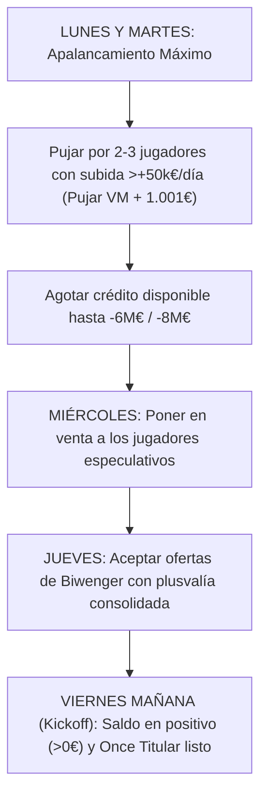

# 📈 Estrategia de Trading y Gestión Financiera: Objetivo Tier 1

Esta guía operativa documenta la estrategia para maximizar el patrimonio, rentabilizar el mercado diario y superar a los líderes de la liga (**Joan GM** y **RusoPoderoso**) aprovechando el apalancamiento semanal de Biwenger.

---

## 🧭 1. El Principio del Apalancamiento Semanal

En Biwenger, un equipo puede estar en saldo negativo de lunes a jueves sin penalización alguna, hasta un límite legal del **25% del valor de la plantilla** (aproximadamente **~9.2M €** de crédito disponible).

> 💡 **Máxima Fundamental:** Tener dinero líquido parado a `+400.000 €` entre semana es dejar de ganar dinero. Todo el capital disponible (saldo + margen negativo) debe estar colocado en activos que suban de valor diariamente.

---

## 🔄 2. El Ciclo Operativo Semanal

### Detalle por Día:

* **Lunes & Martes (Fase de Compra Agresiva):**
  * Localizar en el mercado futbolistas con **`PLAYER_PRICE_INCREMENT > 0`** (idealmente `> +50.000 €/día`).
  * Lanzar pujas de especulación pura.
  * Agotar el crédito hasta rozar el límite permitido en negativo (`-6.000.000 €` a `-8.000.000 €`).

* **Miércoles (Fase de Maduración y Ofertas):**
  * Poner a la venta en el mercado a todos los jugadores que no formen parte del once titular intocable.
  * Recibir las ofertas automáticas de Biwenger (+/- 5% sobre valor de mercado).

* **Jueves (Fase de Saneamiento y Toma de Beneficios):**
  * Aceptar las mejores ofertas del mercado para los jugadores que hayan generado plusvalía o que hayan frenado su subida.
  * Asegurar que el balance quede **estrictamente en positivo (`> 0 €`)** antes del viernes.

* **Viernes (Fase de Competición):**
  * Confirmar alineación titular de 11 jugadores garantizados.
  * Saldo en verde para asegurar la puntuación de la jornada.

---

## 🎯 3. Las 4 Reglas de Oro del Trading

### Regla 1: Disciplina Estricta de Sobrepuja (*No Regalar Margen*)
* **Jugadores para Trading / Especulación:** Pujar únicamente **Valor de Mercado + 1.001 €**. Si un rival sobrepuja con locura, que asuma él la pérdida patrimonial.
* **Jugadores Franquicia (Once Titular):** Máximo sobreprecio permitido de **+3% a +5%** solo si es titular indiscutible y tiene tendencia alcista.

### Regla 2: Cortar Pérdidas Inmediatas (*Stop-Loss*)
* Cualquier jugador de la plantilla con **`PLAYER_PRICE_INCREMENT < 0`** que no sea titular indiscutible debe venderse de inmediato. Mantener parches en devaluación quema entre 100k y 300k por semana.

### Regla 3: No Realizar Clausulazos Tempranos
* Los clausulazos pagan un sobreprecio del 150% o más sobre el valor de mercado. En pretemporada y primeras jornadas destruyen la liquidez necesaria para hacer trading. Reservar clausulazos para momentos avanzados de temporada.

### Regla 4: Medir la Tasa de Revalorización Diaria
* El objetivo del equipo es mantener una subida de plantilla superior a **`+200.000 €/día`** (como RusoPoderoso y Joan GM), multiplicando el valor del club cada semana sin esfuerzo adicional.
