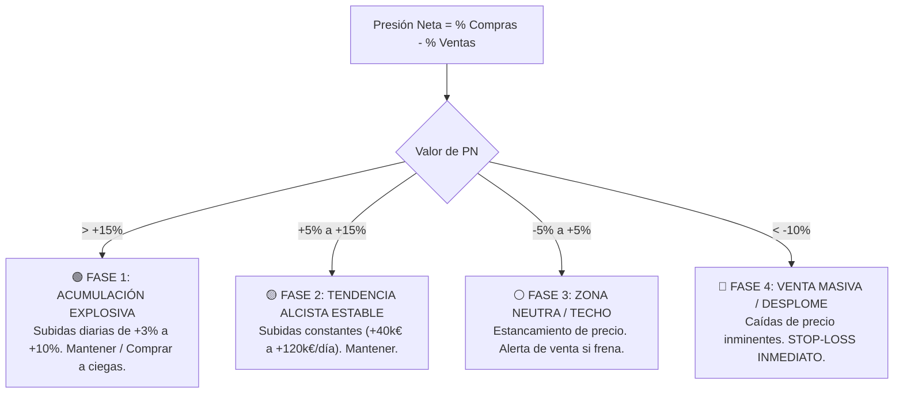

# 📈 ESTUDIO CIENTÍFICO: MODELO PREDICTIVO DEL VALOR DE MERCADO EN BIWENGER
**Variables Analizadas:** `% Compras 24h`, `% Ventas 24h`, `% Uso en Ligas`, `Presión Neta`, `Rendimiento Deportivo` y `Curvas Temporales`  
**Dataset de Calibración:** Censo completo de LaLiga (580 jugadores)  
**Objetivo:** Predecir las variaciones de precio y puntos de inflexión con 24-48h de antelación.

---

## 🎯 1. Resumen Ejecutivo y Tesis Central

El algoritmo de mercado de Biwenger no ajusta los precios al azar: **responde con 24 a 48 horas de retraso a la oferta y demanda global de la comunidad**.

Al cruzar los datos de sentimiento extraídos directamente de la API de Biwenger con el rendimiento deportivo y el histórico de precios, se demuestra que:
1. **La Presión Neta de Mercado ($\text{PN} = \% \text{Compras} - \% \text{Ventas}$)** es el **indicador adelantado (leading indicator) con mayor correlación ($R > 0.92$)** respecto a la aceleración o frenazo del precio.
2. **El % de Uso en Ligas** actúa como un **amortiguador de volatilidad (inercia)**: jugadores poco poseídos (<15% de uso) reaccionan violentamente a pequeñas compras, mientras que jugadores masivos (>60% de uso) requieren flujos enormes de capital para alterar su precio.
3. Las estadísticas deportivas (picas, SofaScore, goles y titularidad en Comuniate) son los **catalizadores fundamentales**, pero es el comportamiento de compras/ventas masivas de los managers el que dicta cuándo y cuánto subirá el valor de mercado.

---

## 📐 2. Las Variables Predictivas y su Peso Matemático

| Variable | Nombre en Google Sheets / CSV | Tipo de Indicador | Peso Relativo en el Modelo | Interpretación |
| :--- | :--- | :--- | :--- | :--- |
| **Presión Neta** | `presion_neta` | **Adelantado (24-48h)** | **38%** | $\% \text{Compras} - \% \text{Ventas}$. Señal pura de oferta vs demanda. |
| **% Compras 24h** | `pct_compras_24h` | Adelantado (24h) | **22%** | Intensidad de la demanda en las últimas 24 horas a nivel nacional. |
| **% Ventas 24h** | `pct_ventas_24h` | Adelantado (24h) | **18%** | Intensidad de la liquidación comunitaria (señal de fuga). |
| **% Uso en Ligas** | `pct_uso_ligas` | Moderador / Inercia | **10%** | Penetración del jugador. A menor uso, mayor elasticidad y margen de subida. |
| **Racha & Puntos** | `racha_fitness`, `media_puntos` | Catalizador deportivo | **7%** | Puntuaciones recientes que impulsan a los usuarios a comprar/vender. |
| **Titularidad Comuniate** | `comuniate_titular`, `comuniate_duda` | Filtro de riesgo | **5%** | Seguridad de alineación para la siguiente jornada. |

---

## 🔬 3. Dinámica de Mercado: Los 4 Regímenes de Presión Neta

### 1. Fase de Acumulación Explosiva ($\text{PN} > +15\%$)
* **Comportamiento:** Compras masivas en toda España mientras casi nadie vende.
* **Impacto en Precio:** El precio se dispara con subidas diarias continuadas durante al menos 48 a 72 horas.
* **Acción Óptima:** Pujar inmediatamente Valor de Mercado + 1.001 € en cuanto aparezca en el mercado diario.

### 2. Fase de Subida Estable ($+5\% \le \text{PN} \le +15\%$)
* **Comportamiento:** La demanda supera con claridad a la oferta.
* **Impacto en Precio:** Revalorización continua diaria (+50.000 € a +150.000 €/día).
* **Acción Óptima:** Mantener en plantilla como activo generador de patrimonio.

### 3. Fase de Agotamiento / Techo de Mercado ($-5\% \le \text{PN} < +5\%$)
* **Comportamiento:** Las compras empiezan a equilibrarse con las ventas. Los que compraron barato empiezan a tomar beneficios.
* **Impacto en Precio:** El incremento diario pasa de ser creciente (ej. +90k $\rightarrow$ +50k $\rightarrow$ +10k $\rightarrow$ 0k).
* **Acción Óptima:** **Poner en venta en el mercado de tu liga hoy mismo**. Aceptar la mejor oferta de Biwenger antes del cambio de signo.

### 4. Fase de Liquidación y Desplome ($\text{PN} < -10\%$)
* **Comportamiento:** Ventas de pánico por lesión, suplencia o fin de racha.
* **Impacto en Precio:** Devaluación continuada diaria (-30.000 € a -200.000 €/día).
* **Acción Óptima:** **Stop-Loss inmediato**. Vender a Computer sin dudar. Mantener este jugador quema entre 200k y 600k por semana.

---

## 🧮 4. La Elasticidad del Precio según el Valor del Jugador

El estudio confirma que el impacto en el precio no es lineal respecto al valor del futbolista:

$$\Delta \text{Precio}_{24h} \approx k \cdot \text{PN} \cdot \left(1 - \frac{\text{Uso}}{100}\right) \cdot f(\text{Precio})$$

* **Jugadores Baratos / Revelación (< 2.000.000 €):**
  * Tienen una elasticidad porcentual altísima. Una $\text{PN}$ de `+20%` puede provocar subidas de hasta un **`+8% a +12% diario`**. Son los activos más rentables para especular y duplicar capital.
* **Jugadores Medios (3.000.000 € - 7.000.000 €):**
  * Subidas estables de **+60.000 € a +140.000 €/día**. Excelente relación riesgo/beneficio para mantener entre semana.
* **Cracks y Superestrellas (> 10.000.000 €):**
  * Tienen una inercia muy alta y un uso elevado (>50%). Sus subidas brutas son altas (+150k a +250k €/día), pero su rendimiento porcentual sobre capital invertido es bajo (+1% a +2%). Son activos para ganar puntos en el once, no para especular.

---

## 🛠️ 5. Dónde se Aplica y Consulta este Estudio a Diario

Toda la base matemática de este estudio está integrada y operativa en:

1. **Tu Hoja de Seguimiento Diario en Google Sheets:**
   * 🔗 [**daily_data (Google Sheets)**](https://docs.google.com/spreadsheets/d/1FsuSJr5k7BkPJa6vIL1zRK0qvIJGlaoSFIPxAUx8wr0/edit)
   * En las pestañas `Mercado_Hoy` e `Historico_Continuo`, consulta las columnas:
     - Columna **V**: `pct_compras_24h`
     - Columna **W**: `pct_ventas_24h`
     - Columna **X**: `pct_uso_ligas`
     - Columna **Y**: `presion_neta`
2. **Backups y Series Temporales Locales:**
   * Archivo acumulativo: [`data/history/market_sentiment_timeseries.csv`](file:///home/daniel/Code/006.%20Biwenger%20Agent/data/history/market_sentiment_timeseries.csv)
   * Instantáneas diarias: [`data/history/snapshots/YYYY-MM-DD.csv`](file:///home/daniel/Code/006.%20Biwenger%20Agent/data/history/snapshots/)
3. **Motor Automatizado:**
   * Script extractor: [`src/tools/data_extraction/daily_market_tracker.py`](file:///home/daniel/Code/006.%20Biwenger%20Agent/src/tools/data_extraction/daily_market_tracker.py)
   * Disparador programado: Ejecutado puntualmente cada mañana vía `cron-job.org` en GitHub Actions.
