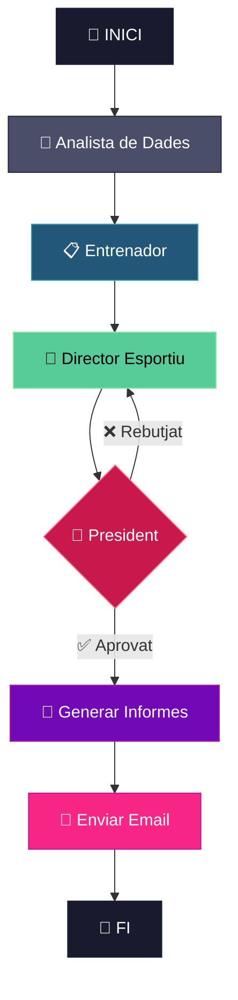

# ⚽ Fantasy Crew — IA Agèntica per a Biwenger


> 📖 També disponible en [English](../README.md) · [Español](README.es.md)

Aquest projecte explora com la **IA agèntica** pot prendre decisions estratègiques en un entorn dinàmic i competitiu. Inspirat en la filosofia **Moneyball** de Billy Beane, el sistema busca maximitzar els punts amb un pressupost determinat, tractant els jugadors com a actius infravalorats en lloc de simples noms.

Els agents operen de manera autònoma: extraient dades en temps real, analitzant tendències de rendiment i generant recomanacions de fitxatges accionables—lliurades directament a la teva safata d'entrada.

---

## 🎯 Concepte Principal

**L'Enfocament Moneyball al Fantasy Football**

Els gestors de fantasy tradicionals confien en la intuïció, els noms estrella i l'afecció emocional. Aquest sistema adopta un enfocament diferent:

- **Eficiència sobre prestigi** → El cost per punt esperat (€/xP) és la mètrica clau
- **Momentum sobre reputació** → La forma recent importa més que les mitjanes històriques
- **Dades sobre intuïció** → Cada decisió està recolzada per evidència estadística

---

## 🤖 L'Equip d'Agents

El sistema orquestra **quatre agents d'IA especialitzats**, cadascun amb un rol diferent en el pipeline de presa de decisions.

| Agent | Rol | Responsabilitat Principal |
|-------|-----|--------------------------|
| **🔮 Analista de Dades** | El Fonament | Extreu, neteja i enriqueix dades de múltiples fonts |
| **📋 Entrenador** | El Tàctic | Analitza la plantilla, recomana alineacions, identifica punts febles |
| **💼 Director Esportiu** | El Broker | Escaneja el mercat buscant valor, proposa fitxatges |
| **🧠 President** | L'Autoritat | Valida propostes, assegura la sostenibilitat financera |

### Detalls dels Agents

**📊 Analista de Dades**
- Matching difús entre Biwenger, Comuniate i dades d'apostes
- Calcula `EXPECTED_POINTS (xP)` basat en forma i probabilitat de jugar
- Computa `COST_PER_XP` — la mètrica d'eficiència definitiva

**📋 Entrenador**
- Maximitza el xP de l'alineació respectant les restriccions de posició
- Marca jugadors amb `MOMENTUM_TREND` en declivi per a possible venda
- Prioritza formacions ofensives (3-4-3) quan és possible

**💼 Director Esportiu**
- Busca fitxatges amb el menor `COST_PER_XP`
- Detecta ineficiències de mercat (jugadors en millora amb preu per sota del seu valor)
- Assegura saldo positiu abans de cada jornada

**🧠 President**
- Aplica severitat financera — rebutja despeses arriscades
- Protegeix actius d'alta inversió de ser venuts amb pèrdues
- Emet les decisions executives finals

---

## 🔄 Arquitectura del Workflow

El sistema utilitza **LangGraph** per orquestrar el workflow dels agents amb gestió d'estat explícita i routing condicional.



**Característiques Clau:**
- **Routing Condicional:** Si el President rebutja una proposta, torna al Director Esportiu per revisió
- **Persistència d'Estat:** Cada agent rep context dels passos anteriors
- **Notificacions per Email:** Informe final lliurat via Gmail SMTP

---

## 📊 Fonts de Dades

| Font | Tipus | Dades Proporcionades |
|------|-------|---------------------|
| **Biwenger API** | Oficial | Jugadors, preus, forma física, classificació, mercat |
| **Comuniate** | Web Scraping | Alineacions probables, probabilitat de titular, alertes de lesions |
| **Jornada Perfecta** | RSS Feed | Notícies en temps real (lesions, rotacions, rodes de premsa) |
| **EuroClubIndex** | Odds | Probabilitats de partit (1X2) per avaluar dificultat |

---

## 🛠️ Stack Tecnològic

| Component | Tecnologia |
|-----------|------------|
| **Orquestració** | LangGraph (StateGraph) |
| **LLM** | DeepSeek API |
| **Processament de Dades** | pandas, thefuzz |
| **Web Scraping** | BeautifulSoup, httpx |
| **Email** | SMTP (Gmail) |
| **Llenguatge** | Python 3.10+ |

---

## 🚀 Començar

### Prerequisits

- Python 3.10+
- Compte de Biwenger
- Clau API de DeepSeek
- Compte de Gmail amb App Password activat

### Instal·lació

```bash
# Clonar el repositori
git clone https://github.com/yourusername/fantasy-crew.git
cd fantasy-crew

# Crear entorn virtual
python3 -m venv .venv
source .venv/bin/activate  # Linux/Mac
# .venv\Scripts\activate   # Windows

# Instal·lar dependències
pip install -r requirements.txt
```

### Configuració

Crea un fitxer `.env` a l'arrel del projecte:

```env
# Autenticació Biwenger
BIWENGER_EMAIL=el_teu_email_biwenger@example.com
BIWENGER_PASSWORD=la_teva_contrasenya_biwenger

# API LLM
DEEPSEEK_API_KEY=la_teva_clau_api_deepseek

# Notificacions Gmail (Opcional)
GMAIL_ADRESS=el_teu_gmail@gmail.com
GMAIL_PASSWORD=la_teva_app_password

# Tipus de Puntuació
SCORE_TYPE=5 #1: Punts AS / 2: SofaScore / 5: Mitjana AS i SofaScore / 3: Stats / 6: Biwenger Social
```

> **Nota:** Per a Gmail, necessites generar una [App Password](https://support.google.com/accounts/answer/185833) — la teva contrasenya normal no funcionarà.

### Executar el Sistema

```bash
# Execució completa amb orquestració LangGraph
python main_langgraph.py
```

### Sortida

Els informes es guarden a `./reports/`:
- `00_final_report.md` — Informe consolidat
- `01_coach_report.md` — Anàlisi de la plantilla
- `02_sporting_director_proposals.md` — Recomanacions de fitxatges
- `03_president_decision.md` — Decisions finals

Si l'email està configurat, l'informe també s'envia a la teva safata d'entrada.

---

## 📁 Estructura del Projecte

```
fantasy-crew/
├── main.py                    # Punt d'entrada seqüencial clàssic
├── main_langgraph.py          # Punt d'entrada orquestrat LangGraph
├── requirements.txt
├── .env                       # Configuració (no rastrejat)
├── src/
│   ├── agents/
│   │   ├── data_analyst.py    # Extracció i enginyeria de dades
│   │   ├── coach.py           # Anàlisi d'alineació
│   │   ├── sporting_director.py # Propostes de mercat
│   │   └── president.py       # Decisions finals
│   ├── graph/
│   │   ├── state.py           # Esquema d'estat LangGraph
│   │   ├── nodes.py           # Funcions de nodes dels agents
│   │   └── graph.py           # Constructor del StateGraph
│   └── utils/
│       └── email_sender.py    # Utilitat SMTP Gmail
├── data/                      # CSVs extrets (generat)
├── reports/                   # Sortida dels agents (generat)
└── docs/
    └── DATA_DICTIONARY.md     # Documentació de camps
```

---

## 📄 Llicència

MIT License — Lliure d'usar, modificar i distribuir.

---

## 👤 Autor

**Daniel Sanchez**  
[LinkedIn](https://linkedin.com/in/daniel-sanchez-rodriguez-51084031) · [GitHub](https://github.com/dani537)

---

> *"L'objectiu no és comprar jugadors. L'objectiu és comprar victòries."* — Billy Beane
