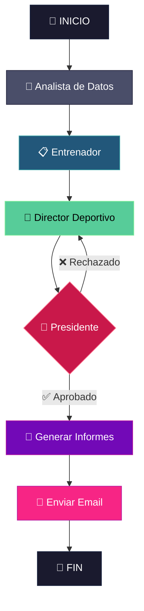

# ⚽ Fantasy Crew — IA Agéntica para Biwenger


> 📖 También disponible en [English](../README.md) · [Català](README.ca.md)

Este proyecto explora cómo la **IA agéntica** puede tomar decisiones estratégicas en un entorno dinámico y competitivo. Inspirado en la filosofía **Moneyball** de Billy Beane, el sistema busca maximizar los puntos con un presupuesto determinado, tratando a los jugadores como activos infravalorados en lugar de simples nombres.

Los agentes operan de manera autónoma: extrayendo datos en tiempo real, analizando tendencias de rendimiento y generando recomendaciones de fichajes accionables—entregadas directamente a tu bandeja de entrada.

---

## 🎯 Concepto Principal

**El Enfoque Moneyball al Fantasy Football**

Los gestores de fantasy tradicionales confían en la intuición, los nombres estrella y el apego emocional. Este sistema adopta un enfoque diferente:

- **Eficiencia sobre prestigio** → El coste por punto esperado (€/xP) es la métrica clave
- **Momentum sobre reputación** → La forma reciente importa más que las medias históricas
- **Datos sobre intuición** → Cada decisión está respaldada por evidencia estadística

---

## 🤖 El Equipo de Agentes

El sistema orquesta **cuatro agentes de IA especializados**, cada uno con un rol diferente en el pipeline de toma de decisiones.

| Agente | Rol | Responsabilidad Principal |
|--------|-----|--------------------------|
| **📊 Analista de Datos** | El Fundamento | Extrae, limpia y enriquece datos de múltiples fuentes |
| **📋 Entrenador** | El Táctico | Analiza la plantilla, recomienda alineaciones, identifica puntos débiles |
| **💼 Director Deportivo** | El Broker | Escanea el mercado buscando valor, propone fichajes |
| **🧠 Presidente** | La Autoridad | Valida propuestas, asegura la sostenibilidad financiera |

### Detalles de los Agentes

**🔮 Analista de Datos**
- Matching difuso entre Biwenger, Comuniate y datos de apuestas
- Calcula `EXPECTED_POINTS (xP)` basado en forma y probabilidad de jugar
- Computa `COST_PER_XP` — la métrica de eficiencia definitiva

**📋 Entrenador**
- Maximiza el xP de la alineación respetando las restricciones de posición
- Marca jugadores con `MOMENTUM_TREND` en declive para posible venta
- Prioriza formaciones ofensivas (3-4-3) cuando es posible

**💼 Director Deportivo**
- Busca fichajes con el menor `COST_PER_XP`
- Detecta ineficiencias de mercado (jugadores en mejora con precio por debajo de su valor)
- Asegura saldo positivo antes de cada jornada

**🧠 Presidente**
- Aplica severidad financiera — rechaza gastos arriesgados
- Protege activos de alta inversión de ser vendidos con pérdidas
- Emite las decisiones ejecutivas finales

---

## 🔄 Arquitectura del Workflow

El sistema utiliza **LangGraph** para orquestar el workflow de los agentes con gestión de estado explícita y routing condicional.



**Características Clave:**
- **Routing Condicional:** Si el Presidente rechaza una propuesta, vuelve al Director Deportivo para revisión
- **Persistencia de Estado:** Cada agente recibe contexto de los pasos anteriores
- **Notificaciones por Email:** Informe final entregado vía Gmail SMTP

---

## 📊 Fuentes de Datos

| Fuente | Tipo | Datos Proporcionados |
|--------|------|---------------------|
| **Biwenger API** | Oficial | Jugadores, precios, forma física, clasificación, mercado |
| **Comuniate** | Web Scraping | Alineaciones probables, probabilidad de titular, alertas de lesiones |
| **Jornada Perfecta** | RSS Feed | Noticias en tiempo real (lesiones, rotaciones, ruedas de prensa) |
| **EuroClubIndex** | Odds | Probabilidades de partido (1X2) para evaluar dificultad |

---

## 🛠️ Stack Tecnológico

| Componente | Tecnología |
|------------|------------|
| **Orquestación** | LangGraph (StateGraph) |
| **LLM** | DeepSeek API |
| **Procesamiento de Datos** | pandas, thefuzz |
| **Web Scraping** | BeautifulSoup, httpx |
| **Email** | SMTP (Gmail) |
| **Lenguaje** | Python 3.10+ |

---

## 🚀 Empezar

### Prerequisitos

- Python 3.10+
- Cuenta de Biwenger
- Clave API de DeepSeek
- Cuenta de Gmail con App Password activado

### Instalación

```bash
# Clonar el repositorio
git clone https://github.com/yourusername/fantasy-crew.git
cd fantasy-crew

# Crear entorno virtual
python3 -m venv .venv
source .venv/bin/activate  # Linux/Mac
# .venv\Scripts\activate   # Windows

# Instalar dependencias
pip install -r requirements.txt
```

### Configuración

Crea un archivo `.env` en la raíz del proyecto:

```env
# Autenticación Biwenger
BIWENGER_EMAIL=tu_email_biwenger@example.com
BIWENGER_PASSWORD=tu_contraseña_biwenger

# API LLM
DEEPSEEK_API_KEY=tu_clave_api_deepseek

# Notificaciones Gmail (Opcional)
GMAIL_ADRESS=tu_gmail@gmail.com
GMAIL_PASSWORD=tu_app_password

# Tipo de Puntuación
SCORE_TYPE=5 #1: Puntos AS / 2: SofaScore / 5: Media AS y SofaScore / 3: Stats / 6: Biwenger Social
```

> **Nota:** Para Gmail, necesitas generar una [App Password](https://support.google.com/accounts/answer/185833) — tu contraseña normal no funcionará.

### Ejecutar el Sistema

```bash
# Ejecución completa con orquestación LangGraph
python main_langgraph.py
```

### Salida

Los informes se guardan en `./reports/`:
- `00_final_report.md` — Informe consolidado
- `01_coach_report.md` — Análisis de la plantilla
- `02_sporting_director_proposals.md` — Recomendaciones de fichajes
- `03_president_decision.md` — Decisiones finales

Si el email está configurado, el informe también se envía a tu bandeja de entrada.

---

## 📁 Estructura del Proyecto

```
fantasy-crew/
├── main.py                    # Punto de entrada secuencial clásico
├── main_langgraph.py          # Punto de entrada orquestado LangGraph
├── requirements.txt
├── .env                       # Configuración (no rastreado)
├── src/
│   ├── agents/
│   │   ├── data_analyst.py    # Extracción e ingeniería de datos
│   │   ├── coach.py           # Análisis de alineación
│   │   ├── sporting_director.py # Propuestas de mercado
│   │   └── president.py       # Decisiones finales
│   ├── graph/
│   │   ├── state.py           # Esquema de estado LangGraph
│   │   ├── nodes.py           # Funciones de nodos de los agentes
│   │   └── graph.py           # Constructor del StateGraph
│   └── utils/
│       └── email_sender.py    # Utilidad SMTP Gmail
├── data/                      # CSVs extraídos (generado)
├── reports/                   # Salida de los agentes (generado)
└── docs/
    └── DATA_DICTIONARY.md     # Documentación de campos
```

---

## 📄 Licencia

MIT License — Libre de usar, modificar y distribuir.

---

## 👤 Autor

**Daniel Sanchez**  
[LinkedIn](https://linkedin.com/in/daniel-sanchez-rodriguez-51084031) · [GitHub](https://github.com/dani537)

---

> *"El objetivo no es comprar jugadores. El objetivo es comprar victorias."* — Billy Beane
