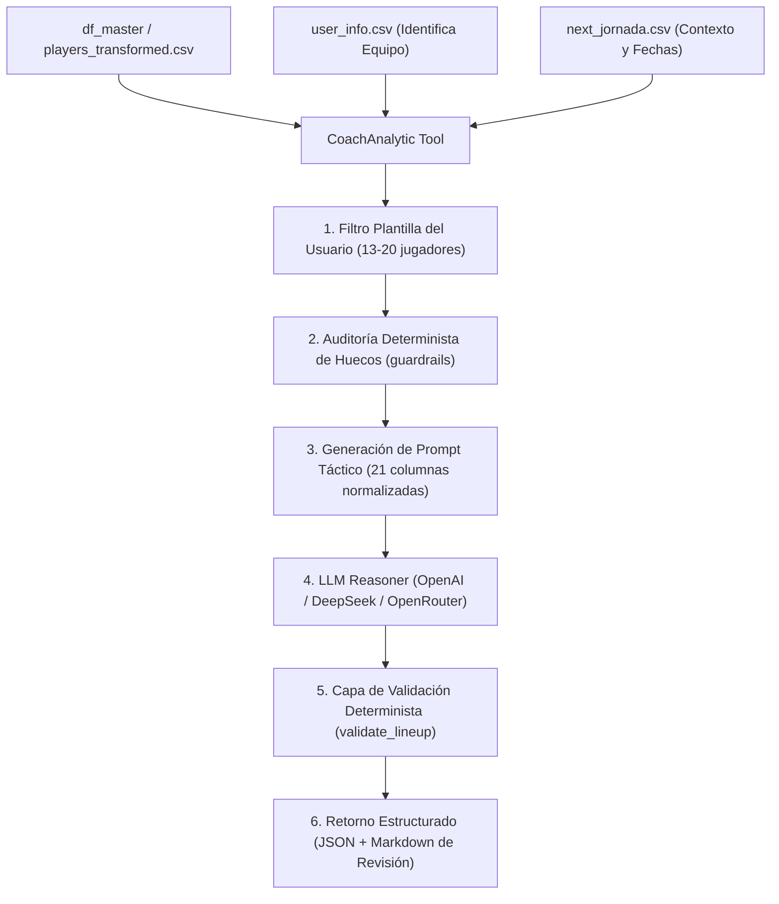

# 📋 Tool: Coach Analytic (`coach_analytic`)

Herramienta de análisis táctico y optimización de alineaciones para el **Agente Biwenger** (compatible con **Pydantic AI**).

---

## 🎯 1. Propósito y Rol de la Tool
Esta herramienta asume el rol del **"Míster" (Head Coach)** del equipo fantasy. Su misión exclusiva es:
1. **Maximizar los Puntos Esperados (xP)** del equipo para la próxima jornada de LaLiga.
2. **Seleccionar la formación legal óptima** (de entre los 7 esquemas oficiales de Biwenger).
3. **Explotar las multiposiciones y el bonus de gol**:
   - Gol de **Defensa (DF)** = **+5 puntos** *(máximo bonus)*.
   - Gol de **Centrocampista (MF)** = **+4 puntos**.
   - Gol de **Delantero (FW)** = **+3 puntos**.
   - Si un jugador tiene `FW, MF`, alinearlo en el centro del campo en un `3-5-2` o `4-5-1` maximiza el valor de sus goles (+4 pts) sin perder potencial ofensivo.
4. **Evitar penalizaciones**: Cada hueco libre o titular no alineado penaliza con **-4 puntos**.
5. **Auditar la plantilla**: Detecta huecos estructurales (ej. falta de portero titular, lesiones) y propone descartes/ventas para financiar nuevos fichajes.

---

## ⚙️ 2. ¿Cómo Funciona por Dentro?



---

## 📥 3. Parámetros de Entrada (`Inputs`)

La herramienta puede invocarse directamente sin parámetros (utilizando los CSVs cacheados de la carpeta `./data/`) o pasando un `DataFrame` en memoria:

| Parámetro | Tipo | Requerido | Por Defecto | Descripción |
| :--- | :---: | :---: | :---: | :--- |
| `df_master` | `pd.DataFrame` | Opcional | `None` *(lee `./data/players_transformed.csv`)* | DataFrame consolidado con todos los jugadores y métricas avanzadas (xP, Comuniate, cuotas, tendencias). |
| `output_dir` | `str` | Opcional | `None` *(guarda en `./data/coach/`)* | Ruta del directorio donde se guardarán los archivos Markdown generados (`coach_prompt.md` y `coach_response.md`). También crea copia canónica en `data/coach_report.md`. |

### Requisitos de Datos Previos:
Para ejecutarse correctamente, deben existir en `./data/`:
* `user_info.csv`: Para identificar el nombre del equipo del usuario (`team_name`).
* `players_transformed.csv`: Para extraer la plantilla y estadísticas.
* `next_jornada.csv` *(opcional)*: Para calcular el tiempo restante hasta el cierre de jornada.

---

## 📤 4. Qué Devuelve la Tool (`Outputs`)

La herramienta devuelve un diccionario Python fuertemente estructurado con el siguiente formato:

```python
{
    "team_name": "Dani SR",
    "jornada_name": "Jornada 2",
    "prompt": "...",                     # String con el prompt completo enviado al LLM
    "raw_response": "...",               # Respuesta cruda del modelo
    "parsed_json": {                     # JSON táctico validado
        "analisis_jugadores": [
            {
                "id_jugador": 41022,
                "nombre": "Pablo Ramón",
                "posicion": "DF",
                "estado_fisico": "disponible",
                "etiqueta_mercado": "intocable"
            }
        ],
        "briefing_direccion_deportiva": {
            "resumen_plantilla": {
                "huecos_titulares_libres": 0,
                "valoracion_general": "Plantilla sólida en defensa pero con falta de gol..."
            },
            "lista_ventas": [
                {
                    "id_jugador": 16321,
                    "nombre": "Álex Berenguer",
                    "motivo": "Exceso de medios y suplente habitual...",
                    "prioridad_venta": "ALTA"
                }
            ],
            "necesidades_fichaje": [
                {
                    "id_necesidad": "req_1",
                    "posicion_requerida": "FW",
                    "prioridad": "ALTA"
                }
            ]
        },
        "alineacion_propuesta": {
            "formacion": "3-5-2",
            "titulares": [
                {"player_id": 41022, "linea": "GK"},
                {"player_id": 35705, "linea": "DF"},
                {"player_id": 16321, "linea": "DF"},
                # ... 11 jugadores exactamente
            ]
        },
        "_lineup_valid": True           # True si cumple al 100% las reglas oficiales de Biwenger
    },
    "squad_df": pd.DataFrame(...),      # DataFrame con los jugadores evaluados
    "prompt_file": "/ruta/01_coach_prompt.md",
    "response_file": "/ruta/02_coach_response.md"
}
```

---

## 💻 5. Ejemplos de Uso

### A. Uso Directo en Python:
```python
from src.tools.coach_analytic import run_coach_analytic

# Ejecutar el análisis táctico
resultado = run_coach_analytic()

print(f"Equipo: {resultado['team_name']}")
print(f"Formación: {resultado['parsed_json']['alineacion_propuesta']['formacion']}")
print(f"Alineación Válida: {resultado['parsed_json']['_lineup_valid']}")
```

### B. Integración como Tool en **Pydantic AI**:
```python
from pydantic_ai import Agent, RunContext
from pydantic import BaseModel
from typing import Dict, Any
from src.tools.coach_analytic import CoachAnalytic, validate_lineup

class CoachAnalyticOutput(BaseModel):
    team_name: str
    formacion: str
    alineacion_valida: bool
    titulares_ids: list[int]
    jugadores_en_venta: list[str]
    necesidades_urgentes: list[str]

# Registro de la Tool en el Agente
@agent.tool
def get_tactical_coach_analysis(ctx: RunContext) -> Dict[str, Any]:
    """
    Ejecuta el análisis táctico del Míster para la plantilla del usuario.
    Retorna la formación recomendada (ej: 3-5-2), los 11 titulares elegidos,
    jugadores recomendados para vender y las posiciones urgentes a fichar.
    """
    coach = CoachAnalytic()
    # Ejecuta el análisis táctico
    resultado = coach.analyze(df_master=None)
    
    parsed = resultado.get("parsed_json", {})
    alineacion = parsed.get("alineacion_propuesta", {})
    briefing = parsed.get("briefing_direccion_deportiva", {})
    
    return {
        "team_name": resultado.get("team_name"),
        "formacion": alineacion.get("formacion"),
        "alineacion_valida": parsed.get("_lineup_valid", False),
        "titulares": [t.get("player_id") for t in alineacion.get("titulares", [])],
        "jugadores_en_venta": [v.get("nombre") for v in briefing.get("lista_ventas", [])],
        "necesidades_urgentes": [n.get("posicion_requerida") for n in briefing.get("necesidades_fichaje", []) if n.get("prioridad") == "ALTA"]
    }
```

---

## 🛡️ 6. Reglas y Validaciones Garantizadas
* ✅ **11 Jugadores Únicos**: No permite duplicados.
* ✅ **7 Esquemas Oficiales**: Solo acepta `3-4-3`, `3-5-2`, `4-3-3`, `4-4-2`, `4-5-1`, `5-3-2`, `5-4-1`.
* ✅ **1 Solo Portero (`GK`)**: Obligatorio.
* ✅ **Concordancia de Posiciones**: Cada jugador debe poseer legalmente en su ficha la posición donde es alineado.
* ✅ **Asignación Explícita de Línea**: `{"player_id": 1234, "linea": "DF"}` permite ubicar a jugadores multiposición en la línea exacta elegida.
